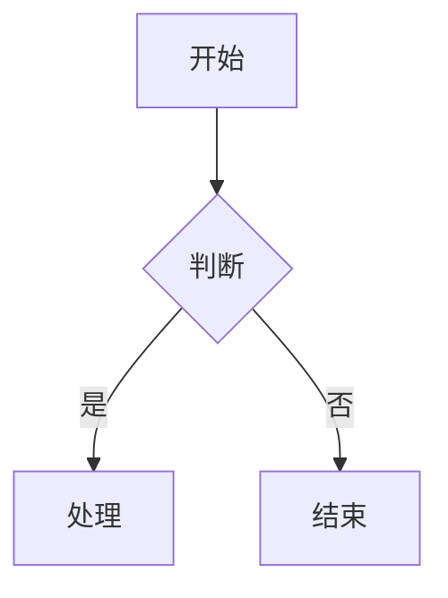

# 演示文档

这是一段**加粗**文字，包含*斜体*、`行内代码` 和 [链接](https://example.com)。

## 代码块

```javascript
function hello(name) {
  return `Hello, ${name}!`;
}
console.log(hello('World'));
```

## 列表

-   无序项目一
-   无序项目二
    -   嵌套子项

1.  有序一
2.  有序二

> 引用一段话：保持专注。

## 表格

| 名称 | 数量 | 备注 |
| --- | --: | --- |
| 苹果 | 3 | 水果 |
| 香蕉 | 5 | 黄色 |

## 公式

行内公式 $E = mc^2$ 和块级公式：

$$
\int_0^\infty e^{-x^2} dx = \frac{\sqrt{\pi}}{2}
$$

## 图表



## 任务

-   [ ]  待办事项一
-   [x]  已完成事项